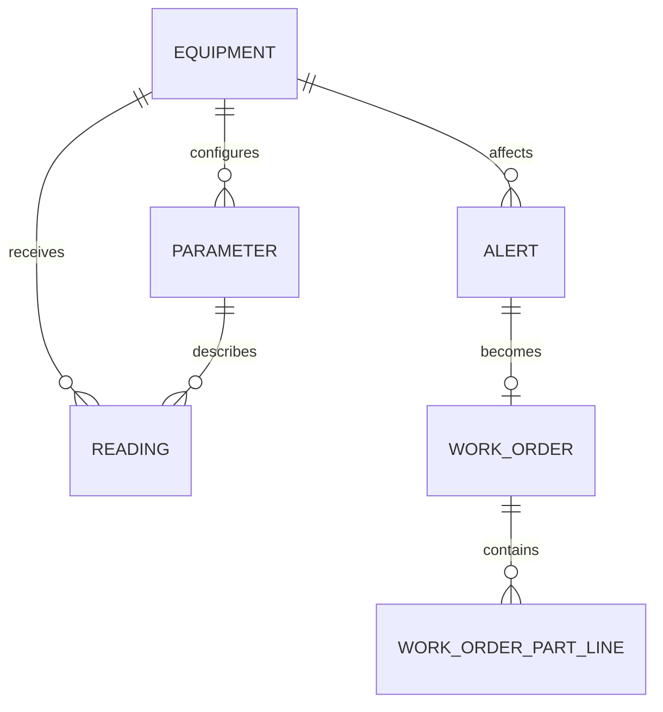

# Entity Relationship Design

Core entities include equipment, parameters, readings, alerts, work orders, and work-order part lines. A work order references one source alert, while an alert may have at most one work order. Closure stores resolution notes, root cause, closed timestamp, and actor.
